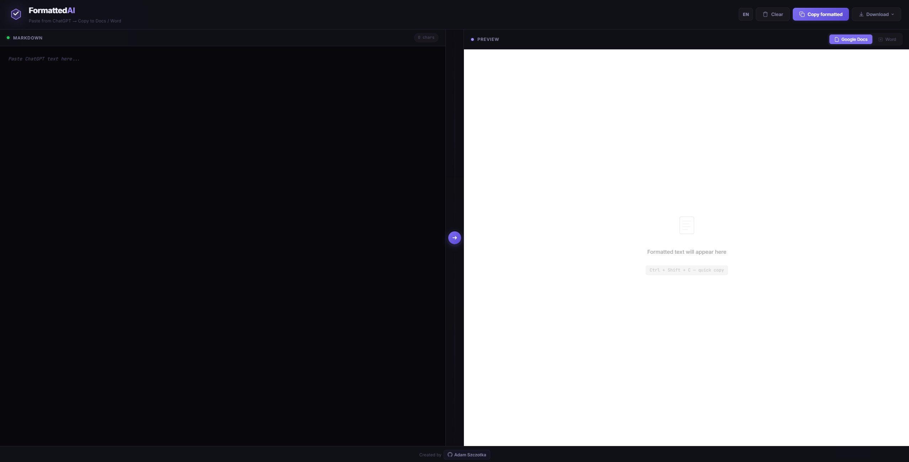
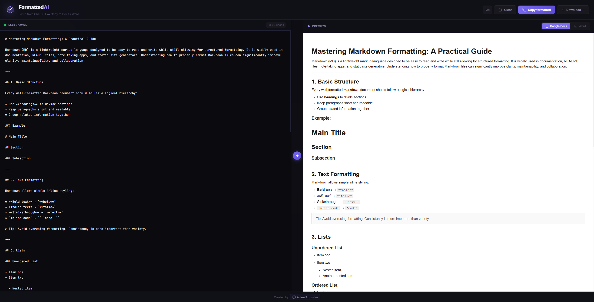
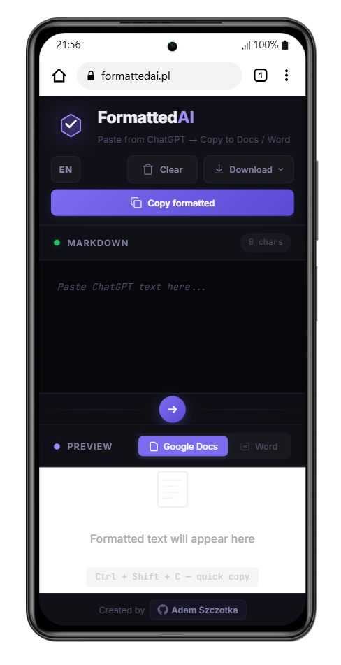

# FormattedAI

Free online tool that converts markdown text from ChatGPT and other AI assistants into perfectly formatted rich text for Google Docs and Microsoft Word.

**Live:** [formattedai.pl](https://formattedai.pl/)



## How it works

1. Paste markdown output from ChatGPT, Claude or any AI assistant
2. Preview the formatted result in real time
3. Copy to clipboard or download as a file



## Features

- Real-time markdown to rich text conversion
- One-click copy with preserved formatting (Ctrl + Shift + C)
- Google Docs and Microsoft Word output styles
- Export to HTML, DOCX and Markdown files
- Bilingual interface (Polish / English)
- Fully responsive design

<p align="center">
  
</p>

## Tech stack

- Vanilla HTML, CSS (SCSS), JavaScript
- [Marked](https://github.com/markedjs/marked) for markdown parsing
- [DOMPurify](https://github.com/cure53/DOMPurify) for HTML sanitization

## Project structure

```
formattedai/
├── index.html
├── assets/
│   ├── css/
│   │   └── style.css
│   ├── scss/
│   │   └── style.scss
│   ├── js/
│   │   └── app.js
│   ├── screenshots/
│   └── favicon.svg
├── LICENSE
└── README.md
```

## Running locally

Open `index.html` in your browser. No build step required.

To recompile styles after editing SCSS:

```bash
sass assets/scss/style.scss assets/css/style.css
```

## License

MIT - see [LICENSE](LICENSE) for details.

## Author

[Adam Szczotka](https://github.com/AdamSzczotka)
