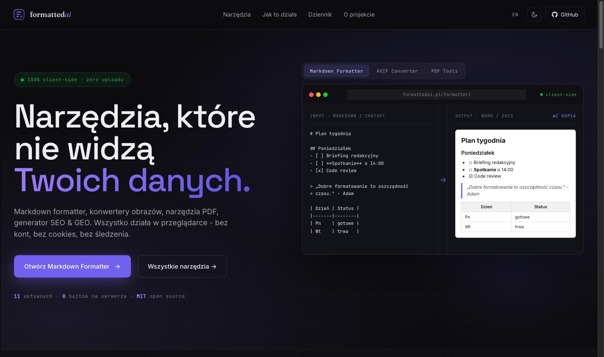
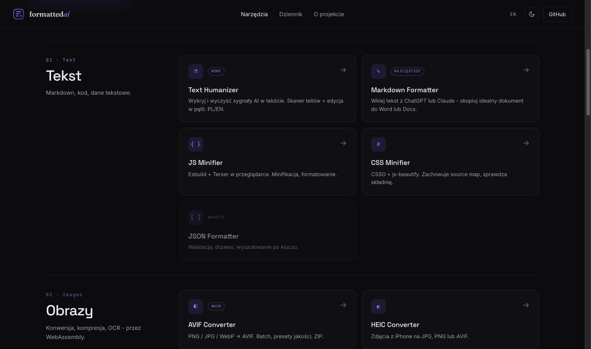
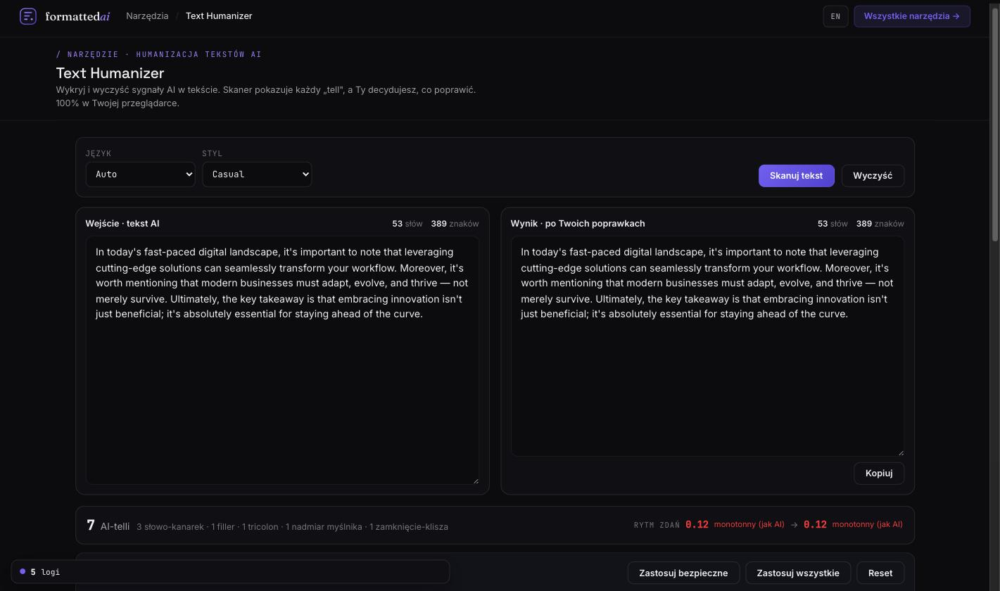
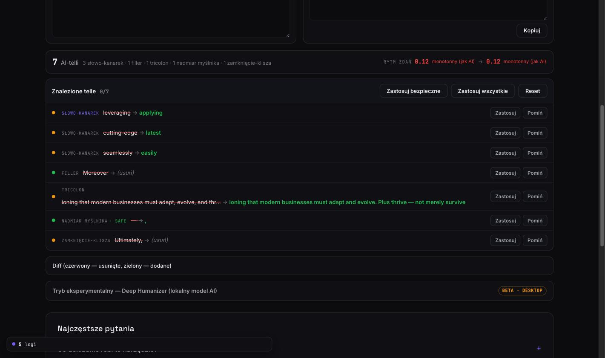
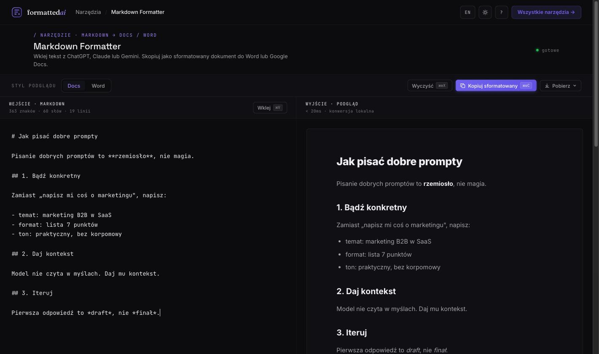
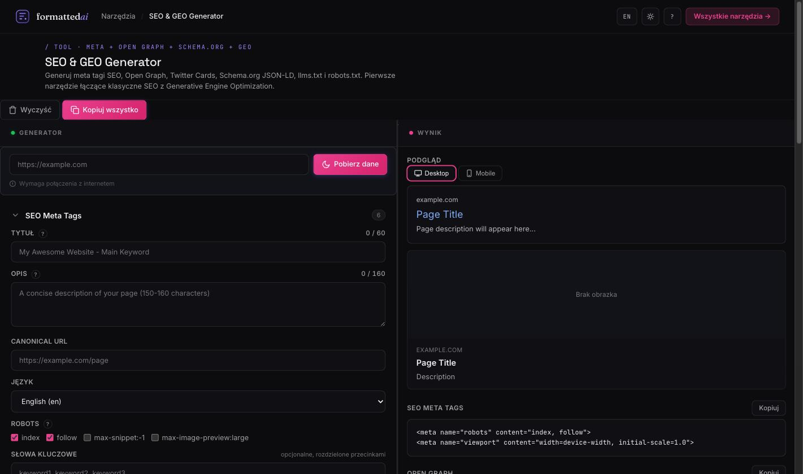
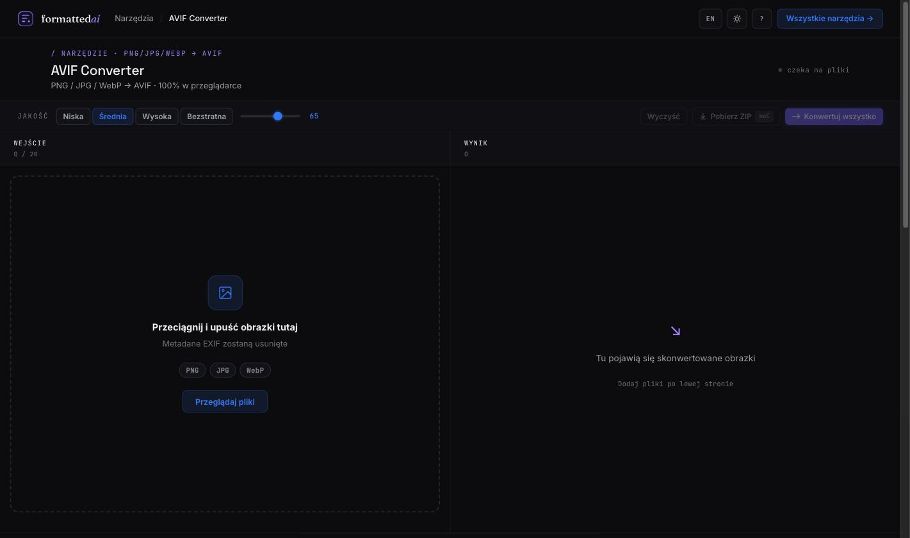

# FormattedAI

**Free, privacy-first web tools for developers and content creators — running 100% in your browser.**


**Live:** [formattedai.pl](https://formattedai.pl/) · **Tool catalog:** [/narzedzia/](https://formattedai.pl/narzedzia/) ([EN](https://formattedai.pl/en/tools/))



---

## What is FormattedAI

FormattedAI is a collection of eleven free online tools for everyday text, image, document and SEO work. The whole thing is a **static site** — no accounts, no cookie banner, no analytics, no telemetry. For the vast majority of tools your data never leaves the browser: parsing, conversion and rendering happen client-side through WebAssembly and JavaScript, so files you drop in are processed on your own machine and nothing is uploaded.

The site is **fully bilingual** — Polish at the root and English under `/en/`, with a mirrored structure and a light/dark theme remembered in `localStorage`. FormattedAI is also **GEO-first** (Generative Engine Optimization): `robots.txt` deliberately welcomes every AI crawler, an `llms.txt` catalog describes the tools for language models, and articles ship the full Schema.org set — the goal is to be indexed *and* cited by AI search engines, not just classic ones.

---

## Tools

Eleven active tools, grouped the same way as the on-site catalog. Everything below runs client-side unless noted otherwise.

### Text

| Tool | What it does |
|------|--------------|
| **[Text Humanizer](text-humanizer/)** &nbsp;`NEW` | Scans text for AI "tells" — canary buzzwords, hedge openers, cliché/resolution closers, filler, em-dash overuse, tricolons — and proposes a fix for each one that you apply or dismiss (plus one-click *apply safe* / *apply all*). Sentence rhythm (burstiness) is surfaced as one signal, not a verdict. An optional, opt-in **Deep Humanizer** runs a local Qwen 2.5 model in-browser via WebLLM (reverse-prompting). PL + EN. |
| **[Markdown Formatter](formatter/)** | Turns ChatGPT / Claude / Gemini markdown into clean rich text for Google Docs and Microsoft Word, with Docs- and Word-style previews and export to HTML / DOCX / MD. Built on Marked + DOMPurify. |
| **[JS Minifier](js-minifier/)** | Minifies and beautifies JavaScript in the browser using esbuild + Terser + js-beautify. |
| **[CSS Minifier](css-minifier/)** | Minifies and beautifies CSS with CSSO + js-beautify, with a syntax check. |

### Images

| Tool | What it does |
|------|--------------|
| **[AVIF Converter](avif/)** | Converts PNG / JPG / WebP to modern AVIF — batch conversion, quality presets, EXIF stripping and ZIP download. WebAssembly (`@jsquash/avif`). |
| **[HEIC Converter](heic/)** | Converts iPhone HEIC / HEIF photos to JPG, PNG or AVIF. WebAssembly. |
| **[OCR](ocr/)** | Recognizes text in images with Tesseract.js (100+ languages) and exports to TXT or Markdown. |

### Documents

| Tool | What it does |
|------|--------------|
| **[PDF Tools](pdf/)** | Merge, split and compress PDFs and convert images to PDF. PDF.js + pdf-lib. |
| **[HTML → PDF](html-to-pdf/)** | Paste HTML or a URL and download a ready PDF. Rendered server-side through headless Chromium (Puppeteer) for render fidelity — see [`api/pdf-service`](api/pdf-service/). |
| **[Email Signature](email-signature/)** &nbsp;`beta` | Builds HTML email signatures for Gmail / Outlook. Currently a hidden beta, kept out of the public catalog. |

### SEO

| Tool | What it does |
|------|--------------|
| **[SEO & GEO Tag Generator](seo-geo/)** | Generates meta tags, Open Graph, Twitter Cards, Schema.org JSON-LD, `llms.txt` and `robots.txt`, with a live SERP/social preview. The first generator to pair classic SEO with GEO. An optional server meta-fetch proxy ([`api/server.js`](api/server.js)) pulls existing tags from a URL. |

---

## Screenshots

**Tool catalog** — the `/narzedzia/` map, grouped Text / Images / Documents / SEO, searchable, with "new" and "coming soon" badges.



**Text Humanizer** — paste AI-written text, scan it, and get a per-issue breakdown (here: 7 tells) with a sentence-rhythm score.



Each tell becomes its own card — buzzword swaps, filler removal, tricolon rewrites, em-dash normalisation, cliché-closer cuts — that you apply or skip individually.



**Markdown Formatter** — raw markdown on the left, rendered rich-text preview on the right, converted locally in the browser.



**SEO & GEO Tag Generator** — form on the left, live SERP/social preview and generated meta code on the right.



**AVIF Converter** — drag-and-drop PNG/JPG/WebP, pick a quality preset, download as AVIF (EXIF stripped).



---

## How it works / Privacy

- **Client-side by default.** Every tool listed above does its work in the browser through WebAssembly and JavaScript — image conversion, OCR, PDF manipulation, minification, markdown rendering and the AI-tell scanner all run locally. Heavy work is offloaded to **Web Workers** (image conversion, minification, WebLLM) to keep the UI responsive.
- **No accounts, no tracking.** There is no login, no cookie banner, no analytics and no telemetry — on purpose.
- **Two deliberate server exceptions**, both in [`api/`](api/) and both hardened (SSRF guard with post-DNS-resolve validation, private-IP blocking, `helmet`, layered rate-limiting, body-size limits and timeouts):
  - **HTML → PDF** ([`api/pdf-service`](api/pdf-service/)) — `puppeteer-core` + headless Chromium, for faithful PDF rendering.
  - **SEO meta-fetch** ([`api/server.js`](api/server.js)) — an Express + Cheerio proxy that works around CORS when reading tags from a URL.

---

## Tech stack

- **Vanilla HTML, CSS and JavaScript** — no framework, no runtime dependencies.
- **[Sass](https://sass-lang.com/)** compiles the SCSS sources to compressed CSS (one entry point per tool).
- **[esbuild](https://esbuild.github.io/)** bundles and minifies the JavaScript (workers included).
- Client-side libraries, vendored under `assets/vendor/`:
  - [Marked](https://github.com/markedjs/marked) + [DOMPurify](https://github.com/cure53/DOMPurify) — Markdown Formatter
  - [@jsquash/avif](https://github.com/jamsinclair/jSquash) + [JSZip](https://stuk.github.io/jszip/) / [fflate](https://github.com/101arrowz/fflate) — AVIF & HEIC image worker
  - [Tesseract.js](https://tesseract.projectnaptha.com/) — OCR
  - [PDF.js](https://mozilla.github.io/pdf.js/) + [pdf-lib](https://pdf-lib.js.org/) — PDF Tools
  - [Terser](https://terser.org/) + [CSSO](https://github.com/css/csso) + [js-beautify](https://github.com/beautifier/js-beautify) — JS / CSS Minifiers
  - [@mlc-ai/web-llm](https://github.com/mlc-ai/web-llm) — Text Humanizer's optional local model
- **Server microservices** (Node + Express) for the two exceptions: `puppeteer-core`, `helmet`, `express-rate-limit`, `cheerio`.

---

## Getting started

**Requirements:** Node.js 20+ and npm. The tools themselves need no server — any static file server works.

```bash
npm install        # dev dependencies (sass, esbuild, terser, csso, js-beautify, web-llm)
npm run build      # full build: CSS (build:css) + JS (build:js)
npm run dev        # watch every SCSS entry in parallel
```

Then serve the repository root with any static server (e.g. VS Code Live Server, or `python3 -m http.server`) and open `index.html`.

Other useful scripts:

```bash
npm run build:css          # SCSS → compressed CSS only
npm run build:js           # JS bundle/minify only
npm run test:pdf           # PDF tool tests
npm run test:texthumanizer # Text Humanizer + AI-tell detector tests
```

Each tool has its own SCSS entry (`assets/scss/<tool>.scss`) with matching `build:<tool>` / `watch:<tool>` scripts in `package.json`.

**Adding a tool** — create the tool folder with an `index.html` (and its `/en/` mirror), add an `assets/scss/<tool>.scss` entry plus `build:<tool>`/`watch:<tool>` scripts, put the logic in `assets/js/`, then link it from the home page, the `/narzedzia/` catalog and `sitemap.xml`.

**Adding an article** — every article is a single `index.html` holding both languages (toggled via `.lang-pl` / `.lang-en` classes). A full set is: `article-draft.md`, the PL `index.html`, the EN `index.html`, three images (`.jpg` + `.avif`), listing cards in both `articles/index.html` files, a `sitemap.xml` entry, and the mandatory Schema.org triple **Article + BreadcrumbList + FAQPage** alongside `hreflang`, Open Graph and Twitter Card tags.

**Deployment** — CI/CD lives in [`.github/workflows/deploy.yml`](.github/workflows/deploy.yml): a push to `main` (or a manual `workflow_dispatch`) runs `npm ci` → `npm run build` → cache-busts asset URLs → `rsync` over SSH to the VPS (served by nginx). The two `api/` services run separately on the VPS.

---

## Project structure

```
/                          # PL, root
├── index.html             # Home
├── narzedzia/             # Tool catalog (searchable, grouped)
├── formatter/  avif/  heic/  ocr/
├── pdf/  html-to-pdf/  email-signature/
├── js-minifier/  css-minifier/  seo-geo/  text-humanizer/
├── articles/              # Blog (PL)
│   ├── index.html         # Listing
│   └── <slug>/            # PL+EN in one index.html, draft.md, images/
├── about/  privacy/
├── en/                    # EN mirror of the root structure
├── api/                   # Two Node/Express microservices
│   ├── server.js          # SEO meta-fetch proxy (Express + Cheerio)
│   └── pdf-service/       # HTML → PDF (puppeteer-core + Chromium)
├── assets/
│   ├── scss/  css/  js/  vendor/  screenshots/
│   └── favicon.svg
├── docs/                  # Plans + README screenshots
├── tests/                 # Node tests (PDF, Text Humanizer)
├── .github/workflows/     # deploy.yml (build + rsync to VPS)
├── sitemap.xml            # Maintained by hand
├── robots.txt             # AI-crawler friendly (GEO)
├── llms.txt               # Tool description for LLMs
└── CLAUDE.md
```

---

## License

MIT — see [LICENSE](LICENSE). Copyright © 2026 Adam Szczotka.

## Links

- **Website:** [formattedai.pl](https://formattedai.pl/)
- **Repository:** [github.com/AdamSzczotka/formattedai](https://github.com/AdamSzczotka/formattedai)
- **Author:** [Adam Szczotka](https://github.com/AdamSzczotka)
