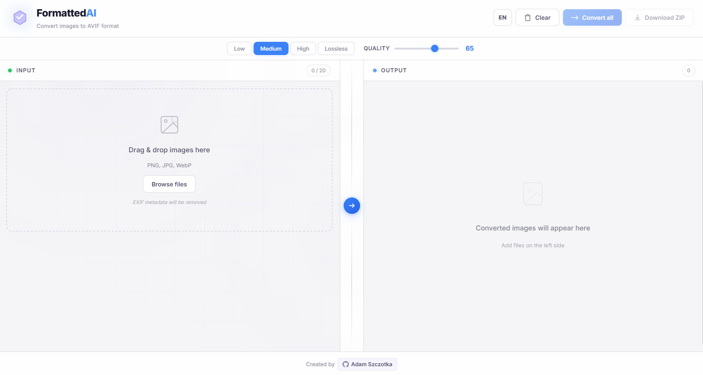
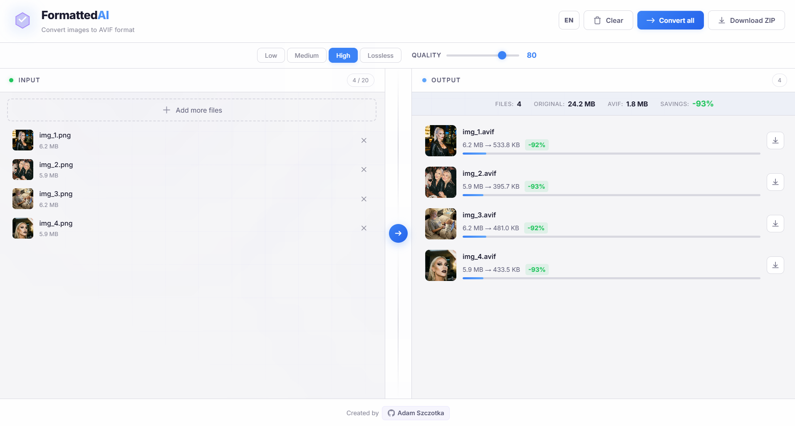
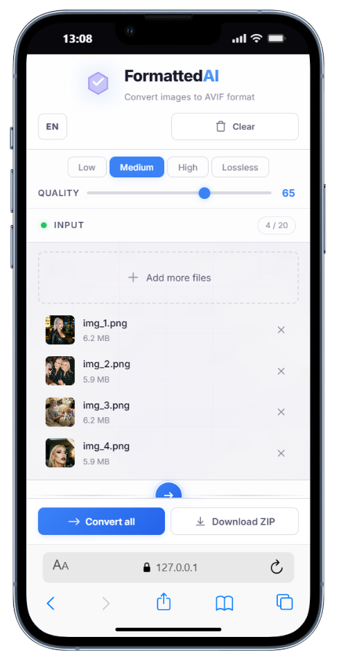
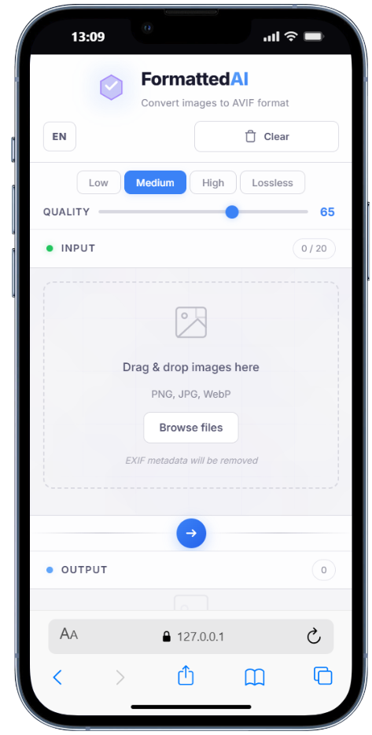

# AVIF Converter

> Part of [FormattedAI](../README.md) — free webdev tools, 100% client-side.

Free online tool that converts PNG, JPG and WebP images to modern AVIF format. All conversion happens directly in your browser — your files never leave your device.

**Live:** [formattedai.pl/avif](https://formattedai.pl/avif/)

## How it works

1. Drag & drop images or click to browse (PNG, JPG, WebP)
2. Adjust quality with presets or slider (default: 65)
3. Click convert — watch the progress bar
4. Download individual files or batch as ZIP

## Features

- Batch conversion (up to 20 files, max 50MB each)
- Quality presets: Low (40), Medium (65), High (80), Lossless (100)
- Real-time progress bar with per-file status
- Single file download or ZIP archive
- Image preview with click-to-zoom modal
- Checkerboard background for transparency preview
- Dark / light theme toggle
- Bilingual interface (Polish / English)
- EXIF orientation auto-fix, metadata stripped for privacy

  
  

## Tech stack

- Vanilla HTML, CSS (SCSS), JavaScript (ESM)
- [@jsquash/avif](https://github.com/jamsinclair/jSquash) — WASM-based AVIF encoder (works in all modern browsers)
- [JSZip](https://stuk.github.io/jszip/) for batch ZIP downloads

## Browser support

Works in all modern browsers. The AVIF encoder runs via WebAssembly — no native AVIF encoding required.

| Browser | Supported |
|---------|-----------|
| Chrome 61+ | Yes |
| Edge 16+ | Yes |
| Firefox 60+ | Yes |
| Safari 11+ | Yes |

## License

MIT — see [LICENSE](../LICENSE) for details.
